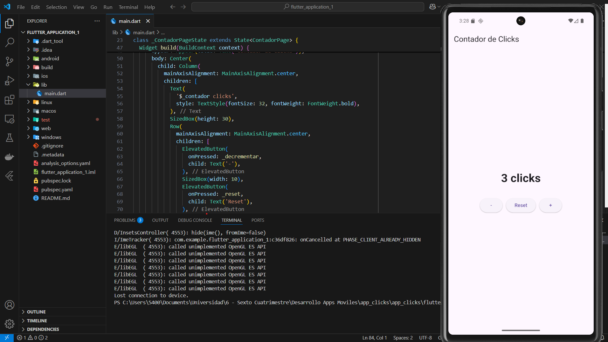

# Contador de Clicks en Flutter

Esta es una aplicación móvil simple desarrollada con **Flutter** que permite incrementar, decrementar y reiniciar un contador con botones interactivos.

## 📱 Captura de Pantalla



## 🚀 Funcionalidades

- Incrementar el contador con el botón "+"
- Decrementar el contador con el botón "-"
- Reiniciar el contador a 0 con el botón "Reset"

## 🛠️ Tecnologías utilizadas

- Flutter
- Dart

## 📁 Estructura del Proyecto

flutter_application_1/
├── android/
├── build/
├── ios/
├── lib/ # Código principal en Dart
│ └── main.dart # Punto de entrada de la aplicación
├── linux/
├── macos/
├── test/
├── web/
├── windows/
├── .dart_tool/
├── .idea/
├── .vscode/
├── .gitignore
├── image.png
├── pubspec.yaml
├── pubspec.lock
└── README.md


## ▶️ Cómo ejecutar

1. Asegúrate de tener Flutter instalado y configurado.
2. Inicia un emulador o conecta un dispositivo físico.
3. Abre una terminal en la raíz del proyecto y ejecuta:

```bash
flutter run
